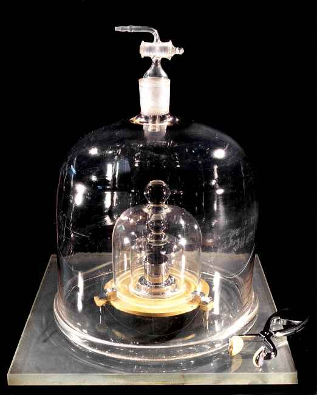

Du 13 au 16 novembre 2018 à Versailles, s'est tenue la 26^e^ réunion de la Conférence Générale des Poids et Mesures. Lors de cette grand-messe de la métrologie internationale, **une nouvelle définition du kilogramme a été adoptée**, accompagnée de nouvelles définitions pour l'ampère, la mole et le kelvin, **qui entrent en vigueur le 20 mai 2019**. La nouvelle définition du kilogramme ne change pas pour autant sa valeur, comme nous l'expliquerons dans cet article (et il en est de même pour les autres unités).

Cette redéfinition ne s'est pas faite en un jour — l'adoption officielle de la nouvelle définition par la CGPM marque l'aboutissement de travaux scientifiques de longue haleine. Il s'agit de la continuité d'un long processus visant à **faire reposer le système international d'unités**, souvent appelé le SI, **sur des constantes fondamentales de la physique** plutôt que sur des objets physiques.

Le kilogramme était en effet la dernière unité définie par référence à un objet physique, à savoir le prototype international du kilogramme. Le mètre, jadis défini comme étant la longueur du mètre-étalon, avait déjà été redéfini en 1983 sur la base de la vitesse de la lumière et de la durée de la seconde.

# Avant le 20 mai 2019, l'ancienne définition

Jusqu’à présent, une masse de 1 kg était définie comme la masse d’un objet appelé « prototype international du kilogramme » ou PIK, aussi surnommé « le grand $\mathbb{K}$ ». Autrement dit, **un kilogramme était la masse d’un certain objet pris pour référence**, dont la masse est *par définition* un kilogramme sans avoir besoin de le peser.

Ce prototype a été fabriqué à la fin du XIXᵉ siècle, est un cylindre constitué d’un alliage de 90 % de platine et 10 % d’iridium, qui lui donne une grande dureté, une bonne résistance à l’oxydation et une grande densité. Ces caractéristiques sont intéressantes pour assurer une soliditéet stabilité, et pour limiter sa taille. Le cylindre mesure 39,17 mm de haut et de diamètre, ce qui permet de minimiser la surface du cylindre exposée à l'air (et donc susceptible de s'abîmer). C'est plus petit qu'une balle de golf[^golf] !

## Pourquoi ça pose problème

Oui après tout, pourquoi ne pas se contenter de cette définition ? Eh bien elle pose plusieurs problèmes.

Tout d'abord, le prototype du kilogramme est un… objet, un vrai, physique et tout[^localisation-prototype], donc **comme tout objet sa masse peut changer.** Rayures, usure, ou même dépôt de poussières ou de molécules présentes dans l'air à sa surface… sont autant de facteurs pouvant causer des variations de masse. Oh, il est protégé, y'a pas de soucis à ce niveau, mais le problème, c'est que c'est **la** référence ! Comme par définition il pèse un kilogramme tout le temps, s'il gagne ou perds de la masse, c'est tous les kilogrammes du monde qui suivent. Gênant, un peu, surtout quand on sait que concrètement sa masse évolue.

En effet, on a des copies du prototype qu'on pèse régulièrement pour les comparer à l'original et… la différence existe et se creuse avec le temps, dans les deux sens ! Difficile donc de savoir précisément comment il a évolué, car il faudrait le comparer avec lui-même… Concrètement et à cause de ça, **la connaissance du kilogramme est limité à ± quelques microgrammes**, ce qui peut sembler tout à fait satisfaisant dans la vie de tous les jours, mais pas du tout pour des usages scientifiques plus avancés.

Le second gros problème, c'est que comme le prototype est unique, il est **difficilement accessible**. D'autres unités (tel que le mètre, la seconde…) peuvent être reproduites dans n'importe quel laboratoire équipé, mais ce n'est pas le cas du kilogramme dans le cadre de cette vieille définition. Techniquement, pour connaître le kilogramme, on était obligé d'avoir le Prototype sous la main… ce qu'est un privilège extrêmement rare : il n'est sorti de ses coquilles, pour le comparer avec les copies et en faire de nouvelles, que tous les 50 ans !

Certes, il y a les copies pour compenser, mais comme on l'a vu, il n’est pas garanti que la masse de la copie soit véritablement proche de celle du prototype. Or **tout le système de métrologie dépend du prototype** : les copies servaient aux laboratoires nationaux, qui possèdent les balances les plus précises, qui servaient elle-même à calibrer les balances des laboratoires de métrologie plus nombreux mais moins précis, qui servaient à leur tour à calibrer les appareils communs dans les laboratoires industriels ou académiques, qui sont utilisés pour (enfin) peser des choses !

Ces problèmes étaient anticipés depuis bien longtemps, mais ils devenaient de plus en plus lourds à porter pour la communauté scientifique. Il fallait faire mieux ! Mais comment ?

> Même si le repère cylindrique du kilogramme est abrité dans un coffre spécial, dans des conditions contrôlées au BIPM,  **sa masse (théorique) peut dériver légèrement au fil des ans** et il est  sujet à des modifications de masse (théorique) en raison de la  contamination, la perte de matériau de surface par nettoyage, ou  d'autres effets.
>
> **Une propriété de la nature est, par définition, toujours la même** et peut en théorie être mesurée n'importe où, **alors que le kilogramme au BIPM pourrait être endommagé ou détruit**.
Source: J. C. Maxwell (1831 – 1879), physicien (il a notamment travaillé sur [l'électromagnétisme](https://fr.wikipedia.org/wiki/%C3%89quations_de_Maxwell))

[^golf]: Une balle de golf mesure 42 millimètres de diamètre, soit 3 de plus que le prototype.
[^localisation-prototype]: Il est dans le sud de Paris, si vous voulez tout savoir.

# Comment redéfinir le kilogramme

On a deux grands critères mentionnés dans la partie précédente :

1. la définition ne doit pas dépendre d'un objet matériel qui peut s'abîmer ;
2. elle doit pouvoir être reproductible partout sans contrainte (autre que la disponibilité du matériel).

Quand on se retourne vers l'histoire de la métrologie[^métrologie], on constate que ce problème est loin d'être nouveau : on avait rencontré le même avec le mètre, la seconde[^anciennes-définitions-mètre-seconde]… Et dans tous ces cas (et d'autres !), la solution retenue qui a bien marché c'est de se baser sur des **constantes fondamentales**.

Une constante fondamentale, c'est une valeur physique universelle et… constante. Par exemple, la vitesse de la lumière en est une : c'est la même valeur partout, depuis toujours, et pour toujours. C'est donc un très bon choix pour ce qu'on veut faire : c'est indépendant d'un objet matériel et reproductible partout (vu que les constantes sont les mêmes dans tout l'univers). En plus, c'est par essence super durable (beaucoup plus qu'un cylindre de platine). Bingo !

## Quelle constante choisir ?

Pour la seconde, on a utilisé la vibration des atomes de césium[^seconde]. C'est extrêmement précis, parfaitement régulier, et connu avec finesse : tout pour plaire ! En ce qui concerne le mètre, c'est la lumière qui fait son office : un mètre est la distance parcourue par la lumière, dans le vide, en 1⁄~299 792 458~ de seconde. La constante utilisée, ici, c'est la vitesse de la lumière, fixée à 299 792 458 mètres par seconde, tout simplement.

On va en fait utiliser l'exacte même logique que la définition du mètre. La logique est la suivante.

1. On a une vieille définition du mètre. Avec, on peut mesurer la vitesse de la lumière.
2. On mesure le plus précisément possible la vitesse de la lumière avec cette vieille définition.
3. Quand on a un niveau de précision suffisant, on décide (arbitrairement) de fixer la vitesse de la lumière à une valeur donnée.
4. On inverse alors la définition : considérant la constante fixée (dans le cas du mètre, $c = 299\, 792\, 458\ m \cdot s^{-1} $), on définit l'unité à partir d'elle.

Ainsi, pour mesurer le mètre, on peut maintenant observer quelle distance parcourt la lumière en 1⁄~299 792 458~ de seconde. Et voilà !

[[q|Attends, on reprend une valeur “au pif” pour redéfinir précisément les unités ? C'est pas gênant ? Ça ne risque pas de rendre le mètre (ou le kilogramme) faux ?]]
| Cette question est naturelle, mais non pas du tout. En fait, il faut bien comprendre que **les unités sont par essence arbitraires** : elles nous servent à mettre le monde réel en nombres et en équations, mais **les valeurs sont en soit sans importance, tant que tout le monde est d'accord**. Il n'y a qu'à voir le nombre absurde de systèmes de mesure différents (métrique, impérial, anciens…) !
|
| Dans le cas des unités qu'on utilise presque partout dans le monde (le système métrique, aussi appelé SI pour _Système International_), tout le monde est bel et bien d'accord, car un organisme unique standardise et “impose” les unités et leurs définitions : le Bureau International des Poids et Mesures (BIPM), basé en France dans le sud de Paris.
|
| Ici, l'effort de mesure de précision avant redéfinition est surtout réalisé afin de ne pas perturber l'usage : avant et après la redéfinition, un mètre reste un mètre, et un kilogramme reste un kilogramme. Mais techniquement, on aurait pu repartir de zéro et changer la longueur d'un mètre (par exemple en fixant $c = 300\, 000\, 000\ m\cdot s^{-1}$ tout pile) — ça aurait causé un bordel monstre pour faire la transition entre l'ancien et le nouveau mètre, mais on aurait pu.

Le nouveau kilogramme suit, donc, la même logique, et le concernant, **c'est la [constante de Planck](https://fr.wikipedia.org/wiki/Constante_de_Planck) qui a été choisie** pour sa redéfinition. Mais qu'est-ce donc que la constante de Planck et quel rapport avec le kilogramme ?

## Kilogramme et constante de Planck

La constante de Planck est une valeur introduite par le physicien allemand [Max Planck](https://fr.wikipedia.org/wiki/Max_Planck) dans le cadre de la physique quantique. Elle est liée à la quantité d'énergie la plus faible que l'on puisse mesurer et sert notamment à quantifier l'énergie de particules (l'électron, par exemple). Curieusement, on peut la relier au kilogramme, et c'est là que les choses deviennent intéressantes…

$$h \approx 6,626 \times 10^{−34}\, \text{J s}$$
Equation: La constante de Planck

Le fait est que l'unité de la constante de Planck (les Joules – secondes, $J\, s$) peut être reliée à une mesure en kilogrammes. Concrètement, ça veut dire qu'**il est possible, en mesurant une masse connue dans des conditions particulières, de trouver la valeur de la constante de Planck**. On peut aussi faire l'inverse : trouver la valeur d'une masse en effectuant une mesure particulière, à condition de connaître la constante de Planck, autrement dit après avoir fixé une bonne fois pour toutes ladite constante de Planck ! Bingo, nous avons notre constante universelle et immuable, il ne reste plus qu'à fixer sa valeur. Mais quelle valeur choisir ?

[[i]]
| L'explication de cette équivalence est disponible [dans la version complète de l'article](./plus#kilogramme-et-constante-de-planck).

[^métrologie]: La métrologie est la science de la mesure, qui s'occupe de définir les grandes unités et qui les approche le plus précisément possible avec des expériences.
[^anciennes-définitions-mètre-seconde]: Pendant un temps, le mètre a été défini comme la longeur d'un étalon en platine, posant les mêmes problèmes que le kilogramme avant le 20 mars 2019. La seconde, quant à elle, était définie en fonction de la durée d'une rotation terrestre, mais on s'est rendu compte que ce n'était pas si régulier que ça…
[^seconde]: Si vous voulez [la définition exacte](https://www.bipm.org/fr/publications/si-brochure/second.html), la seconde est la durée de 9 192 631 770 périodes de la radiation correspondant à la transition entre les deux niveaux hyperfins de l’état fondamental de l’atome de césium 133 au repos, à une température de 0 K. Oui c'est un peu technique, mais que voulez-vous, on a besoin de précision !

​			