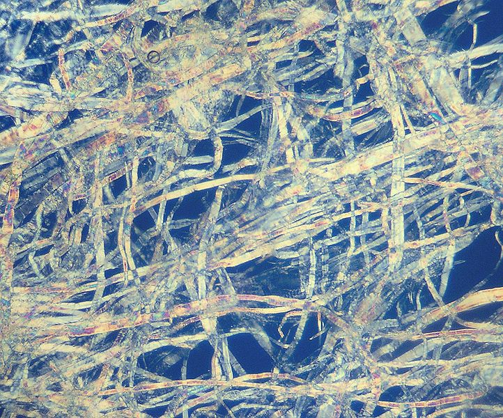

Le papier que nous utilisons en France et dans le monde[^usage-norme-iso-216] a généralement une taille a peu près constante. On a tous entendu parler des formats A4, A3, A5…

Dans ce format, qui commence à A0 avec une page de quasiment un mètre carré, plus le nombre est grand, plus la page est petite. A5 est une demi-page A4. A6, une carte postale. A7, une carte d'identité dans certains pays. A8, le format classique d'une carte de visite ou de cartes à jouer. Et ainsi de suite…

Mais à continuer ainsi à réduire et réduire et réduire, jusqu'où peut-on aller ? Rapidement, des contraintes physiques vont venir nous embêter… Eh bien qu'à cela ne tienne ! Plongeons vers la plus petite page de papier possible :pirate:

[^usage-norme-iso-216]: Plus précisément, ce format de papier est utilisé dans tous les pays sauf aux États Unis et au Canada.

# La logique des noms des formats de papier

Avant de plonger vers le monde des toutes petites pages, il nous faut comprendre comment on passe d'un nom de format à sa taille. Il y a une logique plutôt simple, en réalité.

Tout commence avec le format **A0**, la plus grande page définie habituellement. A0, c'est une page de 841 mm × 1189 mm. Ensuite, chaque page est conçue afin que plier en deux une page dans le sens de la longueur donne deux pages du format suivant (ainsi, une page A0 pliée en deux donne deux pages A1).

Alors, pour obtenir la taille du format A1, on prend comme longueur la largeur du format A0 (841 mm) et comme largeur, la longueur d'A0 divisée par deux (594,5 mm).

Et ainsi de suite, on utilise la même logique pour, successivement, A2, A3, A4, etc.

On peut donc assez facilement calculer toutes les tailles de papier à la main, ou d'une façon automatisée :

- Format A1 : 841 mm × 594.5 mm
- Format A2 : 594.5 mm × 420.5 mm
- Format A3 : 420.5 mm × 297.25 mm
- Format A4 : 297.25 mm × 210.25 mm
- Format A5 : 210.25 mm × 148.625 mm
- Format A6 : 148.625 mm × 105.125 mm
- etc.

[[s|Le code Python utilisé pour calculer cela]]
| N'ayez crainte, si vous ne connaissez pas trop Python ou la programmation, vous pouvez simplement ignorer ceci, c'est à titre purement informatif.

```python
long, larg = 1189, 841
for i in range(6):
    long, larg = larg, long / 2.0
    print(f'Format A{i+1} : {long} mm × {larg} mm')
```

Maintenant, il est temps d'emprunter la réductrice. Ou le massicot, selon vos techiques favorites. Je ne juge pas.

# Première limite : l'épasseur du papier

Une technique un peu naïve pour passer d'un format de papier au suivant, c'est de plier la feuille en deux — comme nous l'avons vu plus haut. Mais le pli successif a une limite, si on conserve la page entière à chaque fois : on peut considérer qu'on ne peut plier décemment une page si son épaisseur est supérieure à sa largeur.

Et ça arrive bien plus vite qu'on ne le pense, surtout si on part d'une page A0 : sachant qu'une page a une épaisseur d'environ 100 micromètres, que le nombre de pages superposées double à chaque pli, et que bien sûr la largeur des pages est à chaque fois divisée par deux… on se rend compte qu'à partir du format A0, on ne peut pas aller plus loin qu'**A8** ! Soit 

# Seconde limite : les fibres

Une feuille de papier n'est pas un matériau parfaitement lisse : il est composé de fibres microscopiques de cellulose, cette dernière étant la même qui compose la paroie des cellules végétales ou le bois.


Figure: Des fibres de cellulose, ici extraites d'un mouchoir en papier grossi 200 fois. ([Source](https://commons.wikimedia.org/wiki/File:Zellstoff_200_fach_Polfilter.jpg?uselang=fr))

Ces fibres ont une taille, donc si on réduit trop, on va finir par avoir une feuille de papier plus petite qu'une fibre qui la compose : ça passe difficilement. Mais à quelle vitesse on y arrive ?

