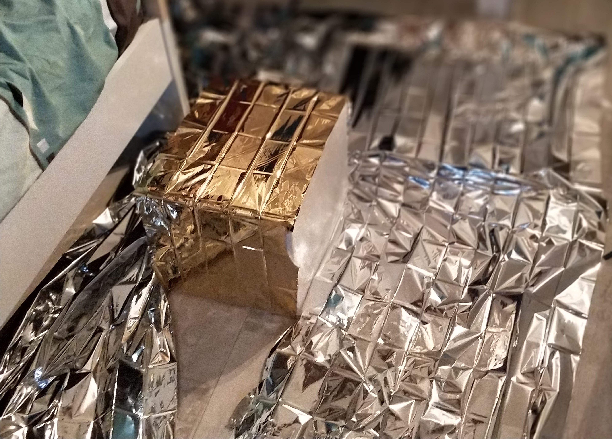

_Cette page est en cours de rédaction. Revenez plus tard ! Le site n'est pas encore officiellement lancé._

Lancer un ballon-sonde ne s'improvise pas la veille pour le lendemain. En l'occurrence, le projet SABLET a débuté au début de l'année 2017 (pour un lancement en août de la même année). Initialement, Timothée Bailly était seul sur le projet, rejoint au milieu de la préparation par Amaury Carrade.

Oh, six mois n'étaient pas vraiment nécessaires pour mener le projet à bien — mais nous n'avions pas 100 % de notre temps à consacrer, et (mais ce sera évoqué plus tard) certains soucis administratifs ont décalé le lancement.

# Préparation

[tweet=https://twitter.com/Yoku_Sama/status/870725624268193793]

Les premiers mois furent consacrés à la mise au point de ce que l'on voulait faire, et aux renseignements et contacts concernant les possibilités que l'on avait. L'objectif initial était clair : réussir l'envol (le premier de cette envergure pour Timothée), et obtenir de belles photographies et films de la Terre vue de la stratosphère, incluant idéalement la courbure de notre planète. Après discussions, s'ajouta celui de prendre des mesures de température, pression, et proportion d'ozone régulièrement dans l'atmosphère grâce à des capteurs intégrés au ballon.

Nous nous sommes entendus sur cette [liste de matériel](/sablet/materiel) : 

- un **ballon** (oui) pour soulever jusqu'à 1200 grammes, de 3,5 m³ ;
- un **parachute**, pour que la nacelle ne retombe pas trop violemment au sol et ne se brise ou n'abîme les composants embarqués ;
- un **réflecteur radar**, afin d'être visible par le reste du monde volant (obligation légale) ;
- une **boîte en polystyrène expansé**, formant la nacelle et contenant tout ce qu'on embarquera dans le ciel ;
- une **couverture de survie** utilisée pour renforcer l'isolation thermique de la nacelle en polystyrène ;
- un **GPS** contactable à distance (dans notre cas par GSM) pour pouvoir retrouver le ballon (sinon, comment savoir où il est tombé ?) ;
- une **caméra** autonome et résistante, filmant en 720p 60 FPS pendant toute la durée du vol ;
- un **RaspberryPi**, un ordinateur miniature, pour servir de cerveau à bord ;
- deux **capteurs de température** (un à l'intérieur et un à l'extérieur de la nacelle) ;
- un **capteur de pression** placé à l'extérieur ;
- de la **cordelette** pour lier tous les éléments entre eux ;
- et enfin **3 400 litres d'hélium** pour gonfler le ballon[^quantité-helium].

[^quantité-helium]: Le calcul permettant de déterminer la quantité d'hélium est détaillé [sur la page dédiée au matériel](/sablet/materiel).

En juin, nous commençâmes à [recevoir les pièces](/sablet/materiel), commandées sur Internet. Il s'agissait de tester le matériel, s'assurant par exemple que la caméra pouvait tenir suffisamment longtemps, mais aussi réfléchir à comment tout assembler proprement. Nous avions trois principales contraintes : 

- le **poids** de la charge utile[^charge-utile], qui était très limité, car il fallait que le ballon puisse décoller et aller haut[^limite-poids] ;
- les **limites du matériel** : la température descend très bas en haute altitude, et tout ce que nous voulions embarquer ne supportait pas de telles conditions ; aussi, il fallait que les appareils devant communiquer avec le sol… puissent le faire[^blocage-gps] ;
- la **loi**, eh oui, qui [impose d'embarquer certains éléments et de respecter certaines normes](/sablet/loi), notamment de vitesse d'ascension.

[^charge-utile]: La charge utile, c'est simplement ce que le ballon transporte… _d'utile_, en plus de lui-même (la nacelle, la caméra, le GPS, les capteurs…).
[^limite-poids]: Quand on monte ce genre de projets, on se retrouve très vite à chercher à économiser le moindre gramme. Ce fut d'ailleurs un des critères du choix des capteurs embarqués, et de tout le reste du matériel d'ailleurs (vous trouverez [plus de détails sur la page dédiée au matériel](/sablet/materiel)). _In fine_, nous sommes arrivés à une masse tout juste au delà du kilogramme (pour la nacelle uniquement).
[^blocage-gps]: Plus de détails sur ça un peu plus bas…

## Tester les limites du matériel

Il fut plus simple de tester certains éléments que d'autres. Les composants électroniques embarqués furent assez simple à tester, dans les limites que nous le faisions sur Terre et non aux températures réelles auxquelles ils allaient être exposés. Cela nous a d'ailleurs donné l'occasion de publier certains de ces tests lorsqu'ils se révélèrent jolis — par exemple, cet innocent _timelapse_ publié sur Instagram a initialement été tourné pour s'assurer que la batterie de la caméra tournerait suffisamment longtemps.

[instagram=https://www.instagram.com/p/BVAgNxeFij0/]

Pour d'autres éléments, il n'était pas vraiment possible de tester, ou de manière très limitée. Difficile, par exemple, de s'assurer du bon déploiement du parachute… sans envoyer un autre ballon (et ce bien que nous annoncions avant le lancement que nous comptions faire ce test !). Aussi, nous n'avions pas de chambre froide pour tester l'isolation de notre nacelle en polystyrène face à une température extérieure de -50 °C, ni pour nous assurer que nos capteurs exposés résisteraient à de telles températures. Cela dit, ce ne fut pas un réel problème étant donné que les limites étaient généralement précisées sur les notices ou _datasheets_ des éléments utilisés.

[tweet=https://twitter.com/Yoku_Sama/status/871437949853982723]

On pourrait penser que ce qui limite la résistance de l'électronique embarquée, ce sont les parties actives (caméras, capteurs…). En réalité le facteur bloquant est tout autre, ces parties actives fonctionnant généralement sans problème à des températures très basses. Non, ce à quoi il faut faire attention quand on envoie de l'électronique à très basse température, ce sont les **batteries**.

Les batteries fonctionnent grâce à des réactions chimiques qui sont beaucoup moins efficaces lorsqu'il fait froid. Dans notre cas et d'après nos relevés, l'intérieur isolé de la nacelle est tombé à -20 °C, une température que nous avions approximativemnt anticipé. Nous n'avions pas jugé nécessaire de chauffer au delà de l'isolation pour éviter que les batteries ne meurent (même si nous l'avions envisagé sérieusement), et tout s'est finalement bien passé, mais avec des batteries plus sensibles au froid ou par simple prudence, il peut être un bonne idée d'y songer (par exemple grâce à des lingettes chauffantes, ou une seconde couche d'isolant autour des batteries).

## Trouver le bon endroit

Notre objectif était certes de lancer le ballon, mais aussi de le récupérer, tant pour pouvoir éventuellement le réutiliser que pour pouvoir récolter les données collectées (film et mesures). Il fallait donc soigneusement choisir le lieu de lancement afin qu'il ne finisse pas, par exemple, dans la mer[^note-mer]… En effet, impossible de contrôler sa trajectoire : une fois lancé, il vogue au gré des vents des différentes altitudes qu'il traverse.

Il existe des outils pour simuler, en prenant les prévisions relatives aux vents d'altitude en compte, la trajectoire et le point de chute d'un ballon stratosphérique, et nous nous en sommes servis pour choisir le point précis de lancement. Seul problème : les prévisions se limitent à quelques jours, et la DSAC exige une déclaration de vol _incluant la localisation précise du décollage_ au moins un mois auparavant…

En réalité ce fut un problème plutôt simple à contourner : nous avons déclaré un lieu suffisamment loin de la mer avec une grosse marge (en l'occurrence, dans la région de Valence), localisation qui fut affinée (sans déclaration) par la suite — pas très légal strictement parlant, mais sans conséquences non plus. _In fine_, nous sommes partis beaucoup plus au sud, vers Montélimar.

Pour anticiper le point de chute du ballon et, de là, choisir le lieu et l'heure idéaux du lancement, nous avons utilisé [_ASTRA Planner_](http://astra-planner.soton.ac.uk/), un utilitaire mis à disposition par l'université de Southampton, dont je présente un exemple de prédiction ci-dessous. En utilisant les données récoltées par les stations métérologique et les modèles de l'atmosphère, et en connaissant les propriétés du ballon (masse, type de parachute, aérodynamisme…), il simule des trajectoires probables du ballon, ce qui permet d'avoir une idée du point de chute. La position précise n'est pas très importante, tant que c'est loin de l'eau : elle nous permettra surtout de s'assurer donc qu'on pourra retrouver le ballon, et de savoir approximativement dans quelle direction se diriger.

Figure: Une simulation réalisée plus récemment, en août 2018, pour donner un exemple. Le point rouge montre le décollage, les points bleus les aterrissages hypothétiques, et les jaunes les lieux d'explosion du ballon, en altitude.  
On notera que les vents, dans cette simulation, vont dans la direction opposée de ce que nous avions en août 2017 pour le vol de notre ballon. Ils se dirigeaient alors vers le sud est, en passant au dessus du Mont Ventoux pour aterrir un peu derrière. Un plan de la réelle trajectoire du ballon sera donné plus bas.

[^note-mer]: Notre localisation de base étant proche de la mer, c'était quelque chose qu'il fallait tout particulièrement prendre en compte.

## Se conformer à la loi

En plus des contraintes de matériel embarqué et de vitesse sus-mentionnées, la loi nous contraint également à une déclaration de lancement auprès de la DSAC.

[tweet=https://twitter.com/Yoku_Sama/status/871302979479105536]

Nous nous sommes un peu fait avoir à ce niveau car nous attendions une réponse, alors que la demande est sous-entendue acceptée en cas de silence de l'administration de plus de trois semaines. Ils ne répondent généralement que s'ils ont quelque chose à redire — ou si ça leur chante, comme ce fut le cas pour notre seconde demande.

[tweet=https://twitter.com/Yoku_Sama/status/898245818364329988]

Vous trouverez tous les détails relatifs à la loi [sur la page dédiée à ce sujet](/sablet/loi) ;) .

*[DSAC]: Direction de la sécurité de l'Aviation civile

## Préparer les codes

Nous embarquions des capteurs ; il fallait bien monter un système pour collecter les données et les stocker pendant le vol afin de les récupérer ensuite. Pour ce faire, nous avons utilisé un [Raspberry Pi](https://www.raspberrypi.org/) qui contrôlait les capteurs de température et de pression et stockait les données sur sa carte SD. (Aucun système d'envoi en continu des données n'était prévu, donc en cas de perte du ballon, on perdait les données avec…) Les caméras et GPS, quant à eux, fonctionnaient indépendemment.

Le détail du fonctionnement du RaspberryPi et les codes sources expliqués sont disponibles [sur la page dédiée à la technique](/sablet/technique).

# Veille du lancement

[tweet=https://twitter.com/Yoku_Sama/status/897826883949264896]

Comme pour tout projet qui se respecte, l'essentiel de l'assemblage des composants (testés autant que faire se peut) fut réalisé la veille. La veille, car fondamentalement, il n'était pas si utile de le faire des dizaines de jours avant (ça reste assez simple à monter), mais aussi car c'était un jour où nous étions physiquement au même endroit (en temps normal, des centaines de kilomètres nous séparent).

Ce fut également l'occasion de finaliser les montages électroniques et les codes sources associés, intégrés dans la nacelle et en dehors (pour les capteurs extérieurs), afin de s'assurer que tout aille bien et se goupille et d'ajouter quelques sécurités sur le stockage des données (mentionnées dans [la page dédiée](/sablet/technique)).

[tweet=https://twitter.com/AmauryPi/status/897874033374613506]

Au delà de cela, ce fut également l'occasion de fixer (définitivement) sur la nacelle sa protection thermique secondaire (en l'occurrence, une couverture de survie)[^note-erreurs-couverture-survie]. Ce qui donne au passage un magnifique air de satellite à la nacelle !

Figure: La couverture thermique du ballon sonde en cours de fixation

Enfin,

[^note-erreurs-couverture-survie]: Et de se planter de bien trop nombreuses fois sur le bon sens des couvertures, les couleurs variant selon les constructeurs… mais chhhht (cela dit faites attention à ce détail si vous faites votre ballon ! se tromper de sens ruine complètement l'intérêt de la couverture de survie, et revient à ne pas en mettre du tout).